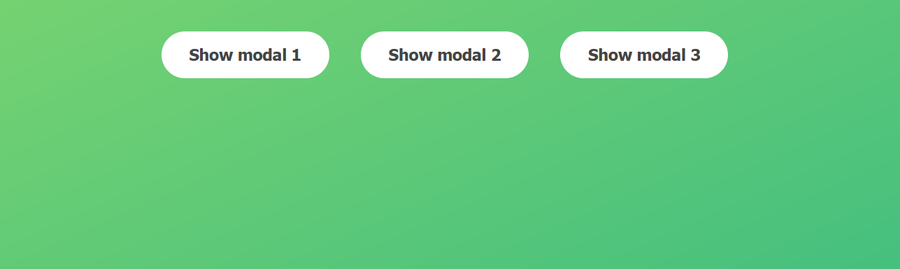

# JS-Modal-App

JavaScript Simple Modal App

<!-- Live link to deployed app -->

Repository: https://github.com/Mdudzik92/JS-Modal-App 
Deployed app: https://mdudzik92.github.io/JS-Modal-App/

<!-- Technologies used -->

HTML, CSS, JavaScript

<!-- Explanation of what the app is -->

This is a very simple app in which the user can open a modal box by clicking any of the three modal buttons. They can then close the modal box again by either clicking the x on the modal box, clicking anywhere else on the page, or pressing the escape key on their keyboard.

<!-- Screenshot -->

<!-- License -->

MIT

<!-- Contact information -->

Email: mdudzik92@gmail.com
